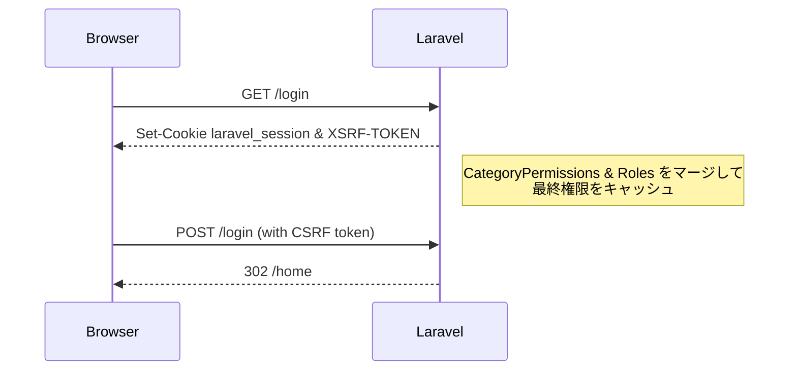
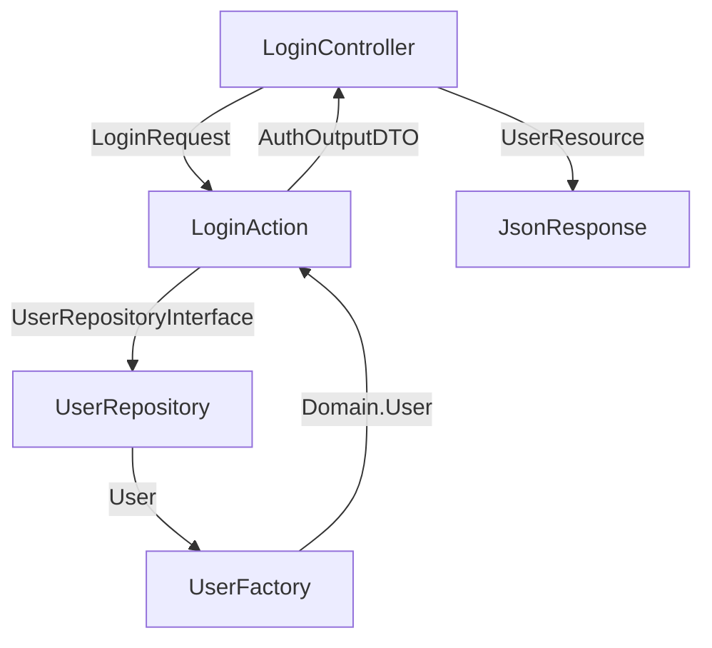

# Harbor | User & Auth Model

---

## 1. 全体像（鳥瞰図）

```````mermaid
erDiagram
    %% Core User and Auth
    users {
        varchar id PK "ULID primary key"
        varchar name
        varchar email UK
        varchar password
        boolean is_active
        varchar remember_token
        timestamp email_verified_at
        timestamp created_at
        timestamp updated_at
    }

    user_categories {
        varchar id PK "ULID primary key"
        varchar code UK "engineer/sales…"
        varchar name "表示名"
        text description
        boolean is_active
        timestamp created_at
        timestamp updated_at
    }

    user_category_assignments {
        varchar id PK "ULID primary key"
        varchar user_id FK
        varchar category_id FK
        boolean is_primary
        date   effective_from
        date   effective_until
        timestamp created_at
        timestamp updated_at
    }

    permissions {
        varchar id PK "ULID primary key"
        varchar key UK "users.view_all, roles.create等"
        varchar resource "リソース名"
        varchar action "アクション名"
        varchar display_name "表示名"
        text description
        timestamp created_at
        timestamp updated_at
    }

    category_permissions {
        varchar category_id FK "複合主キーの一部"
        varchar permission_id FK "複合主キーの一部"
        timestamp created_at
        timestamp updated_at
    }

    role_permissions {
        varchar role_id FK "複合主キーの一部"
        varchar permission_id FK "複合主キーの一部"
        timestamp created_at
        timestamp updated_at
    }

    roles {
        varchar id PK "ULID primary key"
        varchar name
        varchar display_name "表示名"
        timestamp created_at
        timestamp updated_at
    }

    user_roles {
        varchar id PK "ULID primary key"
        varchar user_id FK
        varchar role_id FK
        timestamp assigned_at "割当日時"
        varchar assigned_by FK "割当者ID"
        timestamp created_at
        timestamp updated_at
    }

    %% Optional domain profile example (実装予定)
    employee_profiles {
        varchar user_id PK  "FK to users.id"
        varchar employee_number UK
        date hire_date
        decimal hourly_rate
        timestamp created_at
        timestamp updated_at
    }

    %% Relationships
    users ||--o{ user_category_assignments : "has"
    users ||--o{ user_roles               : "owns"
    users ||--o{ employee_profiles        : "extends"

    user_categories ||--o{ user_category_assignments : "assigned to"
    user_categories ||--o{ category_permissions       : "has"

    roles ||--o{ user_roles : "assigned"
    roles ||--o{ role_permissions : "has"

    permissions ||--o{ category_permissions : "granted to categories"
    permissions ||--o{ role_permissions : "granted to roles"
```````

### 1.2 ドメインモデル クラス図

```````mermaid
classDiagram
    %% Value Objects
    class UserId {
        &lt;&lt;Value Object&gt;&gt;
        -string value
        +create() UserId
        +fromString(string) UserId
        +toString() string
        +equals(UserId) bool
    }

    class Email {
        &lt;&lt;Value Object&gt;&gt;
        +string value
        +__construct(string)
        +equals(Email) bool
    }

    class Name {
        &lt;&lt;Value Object&gt;&gt;
        +string value
        +__construct(string)
    }

    class AccountStatus {
        &lt;&lt;Enum&gt;&gt;
        +ACTIVE
        +INACTIVE
        +SUSPENDED
        +isActive() bool
        +canLogin() bool
    }

    class UserCategoryId {
        &lt;&lt;Value Object&gt;&gt;
        -string value
        +fromString(string) UserCategoryId
        +toString() string
        +equals(UserCategoryId) bool
    }

    class RoleId {
        &lt;&lt;Value Object&gt;&gt;
        -string value
        +fromString(string) RoleId
        +toString() string
        +equals(RoleId) bool
    }

    class PermissionId {
        &lt;&lt;Value Object&gt;&gt;
        -string value
        +fromString(string) PermissionId
        +toString() string
    }

    class PermissionKey {
        &lt;&lt;Value Object&gt;&gt;
        +string value
        +__construct(string)
    }

    class PermissionName {
        &lt;&lt;Value Object&gt;&gt;
        +string value
        +__construct(string)
    }

    %% Collections
    class CategoryIdCollection {
        &lt;&lt;Collection&gt;&gt;
        -Collection~UserCategoryId~ ids
        +fromStrings(array) CategoryIdCollection
        +getPrimaryId() UserCategoryId
        +isEmpty() bool
        +all() array
        +first() UserCategoryId
    }

    class RoleIdCollection {
        &lt;&lt;Collection&gt;&gt;
        -Collection~RoleId~ ids
        +fromStrings(array) RoleIdCollection
        +isEmpty() bool
        +all() array
        +first() RoleId
    }

    class PermissionIdCollection {
        &lt;&lt;Collection&gt;&gt;
        -Collection~PermissionId~ ids
        +isEmpty() bool
        +all() array
    }

    %% Aggregate Root
    class User {
        &lt;&lt;Aggregate Root&gt;&gt;
        +UserId id
        +Name name
        +Email email
        +AccountStatus status
        +CarbonImmutable emailVerifiedAt
        +CategoryIdCollection categoryIds
        +RoleIdCollection roleIds
        -__construct()
        +create(Name, Email, AccountStatus) User
        +reconstitute(...) User
        +activate() User
        +deactivate() User
        +suspend() User
        +changeName(Name) User
        +changeEmail(Email) User
        +assignCategory(UserCategoryId) User
        +assignRole(RoleId) User
        +isActive() bool
        +canLogin() bool
        +equals(User) bool
    }

    %% Entities
    class UserCategory {
        &lt;&lt;Aggregate Root&gt;&gt;
        +UserCategoryId id
        +string code
        +string name
        +string description
        +bool isActive
        +PermissionIdCollection permissionIds
        -__construct()
        +create(code, name, description) UserCategory
        +reconstitute(...) UserCategory
    }

    class Role {
        &lt;&lt;Aggregate Root&gt;&gt;
        +RoleId id
        +string name
        +string displayName
        +PermissionIdCollection permissionIds
        -__construct()
        +create(name, displayName) Role
        +reconstitute(...) Role
    }

    class Permission {
        &lt;&lt;Aggregate Root&gt;&gt;
        +PermissionId id
        +PermissionKey key
        +PermissionName name
        +?PermissionDescription description
        -__construct()
        +create(PermissionKey, PermissionName) Permission
        +reconstitute(...) Permission
    }

    %% Relationships
    User --> UserId
    User --> Name
    User --> Email
    User --> AccountStatus
    User --> CategoryIdCollection
    User --> RoleIdCollection

    UserCategory --> UserCategoryId
    UserCategory --> PermissionIdCollection

    Role --> RoleId
    Role --> PermissionIdCollection

    Permission --> PermissionId
    Permission --> PermissionKey
    Permission --> PermissionName

    CategoryIdCollection --> UserCategoryId
    RoleIdCollection --> RoleId
    PermissionIdCollection --> PermissionId
```````

### 1.1 ３層構造のイメージ

| レイヤ                | 役割           | 例                        | Skeleton に含むか |
| ------------------ | ------------ | ------------------------ | ------------- |
| **Actor (User)**   | ログイン主体・最小カラム | name / email / password  | ✅ Yes         |
| **AuthZ (認可)**     | 権限・職種ラベル     | roles / user\_categories | ✅ Yes         |
| **Domain Profile** | 業務固有属性       | employee\_profiles など    | ❌ 別途拡張        |

---

## 2. 各テーブルの責務

### 2.1 `users`

* **認証に必須** な最小情報のみを保持。
* どのサービスでも意味が変わらないカラムだけ置く。

| カラム         | 説明              |
| ----------- | --------------- |
| `id`        | 主キー（PK）         |
| `name`      | 表示名             |
| `email`     | ログイン ID。ユニーク制約  |
| `password`  | ハッシュ済みパスワード     |
| `is_active` | 退会／休眠などの一時停止フラグ |
| タイムスタンプ     | 監査用             |

### 2.2 `user_categories` & 付随テーブル

* **ビジネス上の属性ラベル**（職種・部署・雇用形態など）。
* `category_permissions` により **標準権限のテンプレ** を束ねる。

### 2.3 `roles` & `user_roles`

* UI・API 単位の **細粒度権限セット**。
* カテゴリだけでは賄えない例外や追加権限を個別付与。

### 2.4 `user_category_assignments`

* ユーザとカテゴリの **紐づけテーブル**。
* `is_primary`, `effective_from`, `effective_until` で「主職種」と「履歴」を管理。

---

## 3. 認証・認可フロー（簡易シーケンス）



1. **ログイン成功時** にユーザのロールとカテゴリを読み取り、権限を合成。
2. 合成結果はセッション（Redis など）にキャッシュして性能を確保。

---

## 4. ドメインプロフィール拡張ガイド

> Skeleton は **プロフィール列を持ちません**。各サービスが必要に応じて外付けしてください。

### 4.1 固定カラム方式（例：勤怠サービス）

```bash
php artisan make:model EmployeeProfile -m
```

```php
// database/migrations/xxxx_create_employee_profiles.php
$table->foreignId('user_id')->primary()->constrained();
$table->string('employee_number')->unique();
$table->date('hire_date');
$table->decimal('hourly_rate', 10, 2);
```

### 4.2 柔軟 (EAV) 方式

```php
Schema::create('user_attribute_values', function (Blueprint $t) {
    $t->id();
    $t->foreignId('user_id')->constrained();
    $t->string('attr_key');
    $t->json('attr_value');
    $t->timestamps();
});
```

### 4.3 推奨パターン選択

| ケース              | おすすめ          |
| ---------------- | ------------- |
| 制約が強い固定列が欲しい     | 固定カラム Profile |
| SaaS で顧客ごとに項目が違う | EAV / JSON    |

---

## 5. 実装のポイント

1. **Actor = User** を崩さない。プロフィールは必ず `user_id` で JOIN。
2. カテゴリとロールは **どちらか一方で完結** しない場合が多い。<br>
   *カテゴリ = デフォルト / ロール = 例外* と覚える。
3. 権限キャッシュは `Gate::before()` や Policy で早期合成すると高速。
4. CSRF トークンは Skeleton 同梱の `VerifyCsrfToken` に任せれば OK。
   curl 手動テスト時だけ `-c/-b cookies.txt` を使う。

---

## 6. よくある質問 (FAQ)

| 質問                       | 回答の要旨                                  |
| ------------------------ | -------------------------------------- |
| **カテゴリだけで権限を全部持たせられない？** | 異動・兼務・例外処理が増えるとカテゴリ爆発。ロールで差分管理する方が安全。  |
| **User テーブルに列追加しちゃダメ？**  | 最小限なら可。ただし Skeleton アップデート時に衝突しないよう注意。 |
| **EAV だと検索が遅い？**         | 型付き列を保持する *shadow column* を用意する設計が有効。  |

---

## 7. 用語対照表

| 日本語    | 英語 / コード名    | メモ        |
| ------ | ------------ | --------- |
| ユーザ    | User         | Actor、本体  |
| 職種     | UserCategory | ビジネス属性ラベル |
| 権限ロール  | Role         | 権限セット     |
| プロフィール | Profile      | 業務固有情報    |

---

## 8. 実際のディレクトリ構成（Clean Architecture）

```
app/
├── Domain/                     # ドメイン層（ビジネスロジック）
│   ├── Identity/               # 認証・認可の集約（ディレクトリ分割なし）
│   │   ├── User.php           # ユーザエンティティ
│   │   ├── UserFactory.php    # ユーザファクトリ
│   │   ├── UserRepositoryInterface.php
│   │   ├── UserId.php         # ユーザID ValueObject
│   │   ├── Email.php          # メールアドレス ValueObject
│   │   ├── Name.php           # 名前 ValueObject
│   │   ├── AccountStatus.php  # アカウント状態 ValueObject
│   │   └── Events/            # ドメインイベント
│   │       └── UserRegistered.php
│   ├── AccessControl/         # 権限管理の集約
│   │   ├── Category/          # カテゴリ管理
│   │   │   ├── UserCategory.php
│   │   │   ├── CategoryIdCollection.php
│   │   │   └── UserCategoryFactory.php
│   │   └── Role/              # ロール管理
│   │       ├── Role.php
│   │       ├── RoleIdCollection.php
│   │       └── RoleFactory.php
│   └── Shared/                # 共有ValueObject
│       ├── Collections/IdCollection.php
│       └── ValueObjects/AbstractUlidId.php
│
├── Application/               # アプリケーション層（UseCase）
│   ├── Identity/              # 認証・認可UseCase
│   │   ├── LoginAction.php
│   │   ├── RegisterAction.php
│   │   ├── GetUserAction.php
│   │   └── Builders/UserBuilder.php
│   └── AccessControl/         # 権限管理UseCase
│       ├── Category/
│       └── Role/
│
├── Adapter/                   # アダプタ層（外部システムとの橋渡し）
│   ├── Identity/              # 認証・認可のアダプタ
│   │   ├── LoginCommand.php   # DTO（UI→UseCase）
│   │   ├── RegisterCommand.php
│   │   ├── UserOutputDTO.php  # DTO（UseCase→UI）
│   │   ├── AuthOutputDTO.php
│   │   ├── LoginPolicy.php    # 認可ポリシー
│   │   └── AuthSessionManager.php # Laravel認証のラッパー
│   ├── AccessControl/         # 権限管理のアダプタ
│   │   ├── RoleOutputDTO.php
│   │   ├── UserCategoryOutputDTO.php
│   │   └── PermissionOutputDTO.php
│   └── Shared/                # 共有アダプタ
│       └── LaravelLogger.php  # ログ実装
│
├── Infrastructure/            # インフラ層（データアクセス）
│   ├── Identity/
│   │   └── UserRepository.php
│   └── AccessControl/
│       ├── Category/
│       └── Role/
│
├── Presenter/                 # プレゼンター層（出力形式の変換）
│   ├── Api/                   # API用レスポンスビルダー
│   │   └── Identity/
│   │       └── AuthResponseBuilder.php
│   └── Web/                   # Web用レスポンスビルダー
│       └── Identity/
│           └── InertiaAuthResponseBuilder.php
│
├── Http/                     # プレゼンテーション層
│   ├── Controllers/
│   │   ├── Api/              # API用コントローラ
│   │   │   └── Identity/
│   │   │       └── LoginController.php
│   │   └── Web/              # Web用コントローラ
│   │       └── Identity/
│   │           └── LoginController.php
│   ├── Requests/
│   │   └── Auth/LoginRequest.php
│   └── Resources/
│       └── UserResource.php
│
└── Models/                   # Eloquent Models（Infrastructure補助）
    ├── User.php
    ├── UserCategory.php
    ├── Role.php
    └── UserRole.php
```

### 8.1 設計原則

1. **Identity集約**: 単一集約として扱い、ディレクトリ分割しない
2. **AccessControl集約**: Category/Role は別々の集約として管理``
3. **Clean Architecture**: 各層の依存関係を明確化
4. **ULID採用**: Domain層でのID管理にULID使用

### 8.2 データフロー



# 9. Policy設計
### 9.1 ディレクトリ構造

| ポイント                                                                              | 方針                              |
| --------------------------------------------------------------------------------- | ------------------------------- |
| Contextでトップレベルを切る                                                                 | `Adapter/Identity/` など          |
| 責務単位（UseCases, Policiesなど）のディレクトリは切らない                                            | ✅ 各ファイル名に責務を埋め込む                |
| `UserPolicy.php` でLaravelのGate/Policyをラップ                                            | ✅ フレームワーク依存をAdapter層に隔離       |
| Laravel標準に従わず、Context内に責務をまとめる                                                    | ✅ PolicyもGateラッパーもContext内に保持する |


```text
app/
├── Adapter/
│   ├── Identity/
│   │   ├── UserPolicy.php                       ◀️ Laravel Gate/Policyラッパー
│   │   └── LoginPolicy.php                      ◀️ 認証ポリシー
│
├── Application/
│   ├── Identity/
│   │   ├── ActivateUser.php                     ◀️ UseCase
│   │   ├── UserActivationPolicyService.php      ◀️ ビジネスルール実装
│   │   ├── GetUserList.php
│   │   └── LoginAction.php
```
* PolicyはAdapter層でLaravel依存を隔離
* ビジネスルールはApplicationサービスに実装

### 9.2 Policyの実装例

```php
<?php

namespace App\Adapter\Identity;

use App\Models\User;
use App\Application\Identity\UserActivationPolicyService;

class UserPolicy
{
    public function __construct(
        private UserActivationPolicyService $policy
    ) {}

    public function activate(User $authUser, User $targetUser): bool
    {
        return $this->policy->canActivate($targetUser->toDomain());
    }
}

namespace App\Application\Identity;

use App\Domain\Identity\User;
use App\Domain\Identity\UserRepositoryInterface;

final class UserActivationPolicyService
{
    public function __construct(
        private UserRepositoryInterface $userRepository
    ) {}

    public function canActivate(User $user): bool
    {
        // ビジネスルールの例：非アクティブユーザーは操作不可
        return $user->isActive();
    }
}


# AuthProviderに追記

protected $policies = [
    \App\Models\User::class => \App\Policies\UserPolicy::class,
    \App\Models\Role::class => \App\Policies\RolePolicy::class,
];

# プレゼン層での呼び出し
$this->authorize('activate', $user); // Laravelが UserPolicy::activate を呼ぶ

```
## 10. アダプタ層
### 10.1 アダプタ層の役割
アダプタ層は、ドメイン層のビジネスロジックを外部システム（UI、API、CLIなど）に適用するための橋渡しを行います。以下のような役割があります。
- **データ変換**: ドメインモデルを外部システムが理解できる形式に変換
- **リクエスト処理**: 外部からのリクエストを受け取り、ドメイン層のUseCaseに適切に渡す
- **レスポンス生成**: ドメイン層からの結果を外部システムが理解できる形式に変換して返す
- **エラーハンドリング**: ドメイン層の例外を適切に処理し、外部システムに伝える
- **セキュリティ**: 認証や認可のチェックを行い、適切なアクセス制御を実施

```text
app/
├── Adapter/
│   ├── Identity/
│   │   ├── UserPolicy.php                   ◀️ Laravel Gateのラッパー
│   │   ├── ActivateUserOutPut.php            ◀️ DTO（UI→UseCaseの中継データ）
│   │   └── ActivateUserCommand.php          ◀️ CLI起点ならここ（UI層）
│
├── Application/
│   ├── Identity/
│   │   ├── ActivateUser.php                     ◀️ UseCase（Application Service）
│   │   └── UserActivationPolicyService.php      ◀️ 認可ロジック（UseCaseから呼ばれる）
```

## 11. プレゼン層
### ✅ ディレクトリ構成例：Http層（プレゼンテーション）
```text
app/
└── Http/
    ├── Identity/
    │   ├── RegisterUserController.php
    │   ├── RegisterUserRequest.php
    │   ├── GetUserListController.php
    │   ├── GetUserListRequest.php
    │   └── LoginUserController.php
    │
    ├── AccessControl/
    │   ├── AssignRoleController.php
    │   ├── AssignRoleRequest.php
    │   ├── RevokeRoleController.php
    │   ├── RevokeRoleRequest.php
    │   └── GetRoleListController.php
    │
    ├── Profile/
    │   ├── UpdateEmployeeProfileController.php
    │   ├── UpdateEmployeeProfileRequest.php
    │   └── GetEmployeeProfileController.php
    │
    └── Shared/
        ├── HealthCheckController.php
        └── VersionCheckController.php
```
| 項目                                        | 説明                                            |
| ----------------------------------------- | --------------------------------------------- |
| **Context単位でディレクトリ分け**                    | `Identity`, `AccessControl`, `Profile` など     |
| **UseCase名がそのままファイル名に**                   | 例：`AssignRoleController`, `AssignRoleRequest` |
| **FormRequestはControllerと同じContext配下に置く** | Contextローカルにまとめて保守性UP                         |
| **Shared系はルート直下でOK**                      | Auth不要のAPI・ステータス系を想定                          |


## 12. presender


### 🎯 目的
- アプリケーション層（UseCase）は純粋な DTO を返す
- プレゼンテーション層（Controller）はその DTO を受け取り、出力形式（JSON, CSVなど）に変換する責務を持つ
- この変換ロジックを Presenter 層に閉じ込めることで、出力戦略の差し替え・統一・テスト容易性を確保する

```text
app/

├── Presenter/
│ └── Identity/
│ ├── UserResponseBuilderInterface.php
│ ├── JsonUserResponseBuilder.php
│ ├── CsvUserResponseBuilder.php（optional）
├── Http/
│ └── Identity/
│ └── GetUserListController.php ← presenterをDIで受け取る
```

### 12.1 API/Webのresponseの分離
- Presenter\ApiResponseBuilder DTO → JSON整形
- Presenter\Web\ViewResponseBuilder DTO → Inertia::renderやRedirect構築

### ✅ ポイント

- `Presenter\*ResponseBuilderInterface` は Controller 側が依存する（UseCaseは知らない）
- Presenter 内では DTO → `array` または `JsonResource` への変換を担う
- テストや複数チャネル（Web/CSV/CLI）への出力切り替えが容易

### 🧠 呼び出し例（Controller側）

```php
public function __invoke(
    GetUserListAction $action,
    UserResponseBuilderInterface $presenter
): JsonResponse {
    $dtoList = $action->handle();
    return response()->json($presenter->buildList($dtoList));
}
```

## 13. Web/APIディレクトリ
* 外部システム連携、モバイル対応を考えた時にAPIも対応する
* WebとAPIのコントローラを分けることで、責務を明確化する

```text
app/
├── Http/
│   ├── Controllers/
│   │   ├── Web/
│   │   │   └── Identity/
│   │   │       └── LoginController.php       ← Inertia用
│   │   ├── Api/
│   │   │   └── Identity/
│   │   │       ├── LoginUserController.php   ← API用
│   │   │       └── LogoutUserController.php
```

### 13.1 WebとAPIの設計における違いと設計指針まとめ

#### 前提：エンドポイントごとに要求される責務が違う
| 項目        | Web                       | API                       |
| --------- | ------------------------- | ------------------------- |
| レスポンス形式   | HTML / Redirect / Inertia | JSON / Binary / HTTPステータス |
| 状態管理      | セッションベース                  | トークン（ステートレス）              |
| ユーザー体験    | 画面遷移・Flash・View構築         | フロントで描画（SPA）              |
| エラーハンドリング | リダイレクト・エラーページ             | JSONで構造化 or ステータスコード      |

### 13.2 Controller設計の方針
```text
app/Http/Controllers/
├── Web/
│   └── User/LoginController.php
├── Api/
│   └── User/LoginController.php
```
→ WebとAPIはコントローラを分けて設計する

| 理由                                   |
| ------------------------------------ |
| I/Oが異なる（セッション vs トークン、HTML vs JSON）  |
| 成功時のレスポンスが違う（リダイレクト vs JsonResponse） |
| エラー処理方法が違う                           |

### 13.3  Queryの扱い：「見るだけ」処理はQueryServiceで

#### 典型パターン
* ユーザー一覧にロールも表示したい
* 検索で複数の集約を横断する必要がある
* 結果を画面用に整形したい（ViewModelが欲しい）

```text
app/Application/User/SearchUserQueryService.php
```


> **最終メッセージ**
> Skeleton は "できるだけ薄く、あとで太らせる" 方針で設計されています。ここに載っていない列やビジネスロジックは、あなたのサービス側で自由に拡張してください。わからない場合は **Issue** や **Slack** で気軽に相談してください！

## 14. Inertiaのエラーハンドリング

HandleInertiaRequests.phpでエラーを明示的に共有する必要がある：

```php
public function share(Request $request): array
{
    return [
        ...parent::share($request),
        'errors' => function () use ($request) {
            return $request->session()->get('errors')
                ? $request->session()->get('errors')->getBag('default')->getMessages()
                : (object) [];
        },
    ];
}
```

## 15. 権限設計の原則

- 基本機能（プロフィール編集、ダッシュボード表示）は権限不要
- 権限は「制限したい機能」にのみ設定
- UserCategory（職種）の権限は職種に関連するものだけ
- 共通権限や特殊権限はRoleで管理

## 16. Clean Architecture でのエラーハンドリング

- ValidationExceptionなどのビジネスエラーはController層でハンドル
- Web/APIでControllerを分けているため、それぞれで適切なエラー形式に変換
- Handler.phpは予期しないシステムエラーのみ扱う
